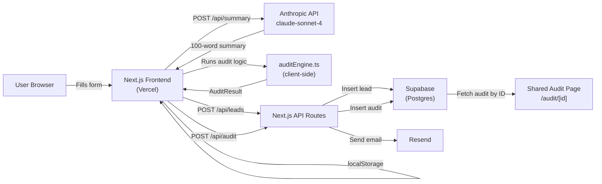

# Architecture

## System Diagram

## Data Flow: Input → Audit Result

1. User fills the spend input form on `/` — selects tools, plans, seats, monthly spend
2. Form state is persisted to `localStorage` on every change
3. On "Run My Audit" click, user is routed to `/audit`
4. `/audit` reads form state from `localStorage`, passes it to `auditEngine.ts`
5. `auditEngine.ts` runs synchronously in the browser — no API call needed for core logic
6. Results render immediately; simultaneously a `POST /api/summary` fires to Anthropic API
7. Anthropic returns a 100-word personalized summary; fallback to templated summary on failure
8. User submits email → `POST /api/leads` stores lead in Supabase + sends Resend email
9. Simultaneously `POST /api/audit` saves sanitized audit data (no PII) → returns UUID
10. Shareable URL `/audit/{uuid}` is shown — fetches audit data from Supabase server-side

## Why This Stack

**Next.js 14 (App Router)**
The shareable URL feature requires server-side rendering for proper Open Graph meta tags —
`/audit/[id]` uses `generateMetadata()` which runs server-side and fetches from Supabase.
Next.js App Router makes this trivial. API routes eliminate the need for a separate backend.

**TypeScript**
Strongly typed `FormState`, `ToolEntry`, `AuditResult` interfaces catch bugs at compile time.
The audit engine has complex conditional logic — types make it readable and refactorable.

**Supabase**
Postgres under the hood, free tier covers this use case, instant REST API, row-level security.
Alternative considered: Firebase — rejected because Postgres is more appropriate for
structured relational data and the query patterns are SQL-friendly.

**Resend**
Simplest transactional email API. Free tier covers 3,000 emails/month.
Alternative considered: Postmark — slightly more expensive, no meaningful advantage at this scale.

**Tailwind + shadcn/ui**
Headless components with full style control. No pre-built admin template.
Dark slate aesthetic was built from scratch using Tailwind utility classes.

**Vercel**
Zero-config Next.js deployment. Auto-deploys on push to main. Free tier sufficient.

## What I'd Change at 10,000 Audits/Day

At 10k audits/day (~115 audits/minute):

1. **Audit engine stays client-side** — it's pure synchronous JS, no server load
2. **Supabase connection pooling** — enable PgBouncer on Supabase Pro to handle
   concurrent inserts from API routes
3. **Anthropic API rate limits** — add a queue (Upstash QStash or Inngest) so summary
   generation is async; show "generating..." state and poll for result
4. **Edge caching for shared audit pages** — `/audit/[id]` results never change,
   add `Cache-Control: public, max-age=86400` headers to avoid repeated Supabase reads
5. **Rate limiting on API routes** — add Upstash Redis rate limiting on `/api/leads`
   to prevent abuse at scale (currently using honeypot only)
6. **Separate read/write Supabase clients** — use service role key server-side for
   writes, anon key for reads